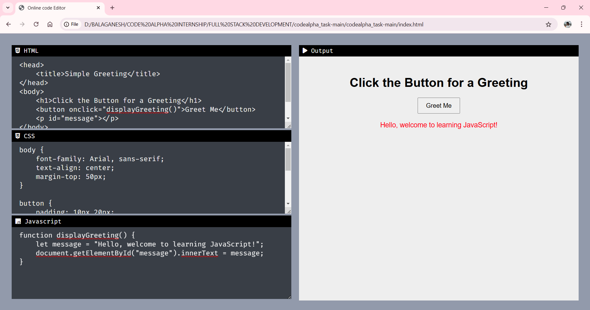
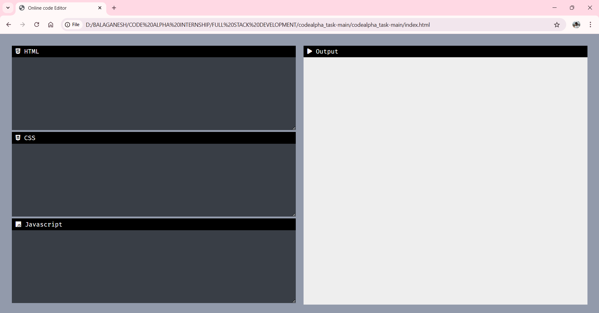

# Live Code Editor

**Real-Time Web Development Environment**

A powerful web-based code editor that enables developers to write and test HTML, CSS, and JavaScript code instantly. This interactive development environment provides real-time preview capabilities, making it perfect for rapid prototyping, learning, and experimentation.

---

## 🎯 Key Highlights

- **⚡ Real-Time Preview** - Instant code rendering as you type
- **📱 Responsive Design** - Works seamlessly on desktop and mobile devices
- **🎨 Multi-Language Support** - HTML, CSS, and JavaScript in one interface
- **🔧 User-Friendly Interface** - Clean, intuitive design for enhanced productivity
- **🚀 Zero Setup** - No installation required, runs directly in the browser
- **💡 Educational Tool** - Perfect for learning and teaching web development
- **🌐 Live Demo Available** - [View the website](https://bala1403.github.io/live-code-editor/)

---

## 📋 Table of Contents

- [Features](#-features)
- [System Architecture](#-system-architecture)
- [Usage Guide](#-usage-guide)
- [Technical Details](#-technical-details)
- [Screenshots](#-screenshots)
- [License](#-license)

---

## ✨ Features

### Core Functionality
- **Real-Time Code Execution** - See changes instantly as you type
- **Multi-Panel Interface** - Separate editing areas for HTML, CSS, and JavaScript
- **Live Output Preview** - Immediate visual feedback of your code
- **Responsive Layout** - Optimized for various screen sizes and devices
- **Clean Console Interface** - Clearly labeled panels for better organization
- **Syntax-Friendly Display** - Readable formatting for enhanced code clarity

### User Experience
- **Intuitive Design** - Easy-to-use interface suitable for beginners and experts
- **Seamless Integration** - All three languages work together harmoniously
- **Interactive Learning** - Perfect environment for experimentation and education
- **Cross-Browser Compatibility** - Works across all modern web browsers

---

## 🏗 System Architecture

The Live Code Editor is built with a clean, modular architecture that ensures optimal performance and user experience:

### 1. 🏷️ HTML Structure Layer

**Purpose**: Provides the foundation and layout structure for the editor interface

**Key Components**:
- **Editor Panels**
  - Dedicated input areas for HTML, CSS, and JavaScript
  - Clearly labeled sections for better organization
  - Textarea elements with syntax-friendly formatting
  - Responsive panel sizing and arrangement

- **Preview Container**
  - Real-time output display area
  - Iframe-based rendering for security and isolation
  - Dynamic content updates without page refresh
  - Full-screen preview capability

- **Interface Elements**
  - Navigation and control buttons
  - Panel headers and labels
  - Status indicators and feedback messages
  - Responsive grid layout structure

### 2. 🎨 CSS Styling Layer

**Purpose**: Creates an attractive, user-friendly visual interface

**Key Features**:
- **Modern Design System**
  - Clean, minimalist interface design
  - Consistent color scheme and typography
  - Professional appearance suitable for development work
  - Intuitive visual hierarchy

- **Responsive Layout**
  - Flexible grid system that adapts to screen sizes
  - Mobile-first design approach
  - Optimal viewing experience on all devices
  - Smooth transitions and animations

- **Code Panel Styling**
  - Syntax highlighting preparation
  - Readable font families optimized for code
  - Proper spacing and indentation display
  - Focus states and user interaction feedback

- **User Experience Enhancements**
  - Hover effects and interactive elements
  - Loading states and visual feedback
  - Error indication and success states
  - Accessibility-compliant design elements

### 3. ⚙️ JavaScript Functionality Layer

**Purpose**: Enables real-time code execution and dynamic preview generation

**Key Features**:
- **Real-Time Processing Engine**
  - Event listeners for live code input detection
  - Debounced input handling for optimal performance
  - Automatic code compilation and execution
  - Error handling and graceful degradation

- **Code Integration System**
  - HTML content parsing and validation
  - CSS style injection and application
  - JavaScript code execution in isolated environment
  - Cross-language variable and function sharing

- **Preview Generation**
  - Dynamic iframe content creation
  - Secure code execution environment
  - Real-time DOM manipulation
  - Automatic refresh and update mechanisms

- **User Interaction Management**
  - Keyboard shortcuts and hotkeys
  - Copy/paste functionality
  - Undo/redo capabilities
  - Code formatting and beautification

---

## 📱 Usage Guide

### Getting Started

1. **Access the Editor**
   - Open the Live Code Editor in your web browser
   - No installation or setup required
   - Compatible with all modern browsers

2. **Interface Overview**
   - **HTML Panel**: Write your HTML structure code
   - **CSS Panel**: Add styling and visual design
   - **JavaScript Panel**: Include interactive functionality
   - **Output Panel**: View the live result of your code

### Development Workflow

#### HTML Development
1. Start by writing your HTML structure in the HTML panel
2. Use semantic HTML elements for better accessibility
3. See the basic structure appear in the output panel immediately
4. Add attributes and content as needed

#### CSS Styling
1. Switch to the CSS panel to add visual styling
2. Target HTML elements using selectors
3. Watch styles apply in real-time as you type
4. Experiment with different properties and values

#### JavaScript Functionality
1. Add interactivity using the JavaScript panel
2. Write event handlers and dynamic behavior
3. See JavaScript effects execute immediately
4. Debug using browser developer tools if needed

### Best Practices

#### Code Organization
- Write clean, well-structured HTML markup
- Use meaningful CSS class names and IDs
- Comment your JavaScript code for clarity
- Organize code logically within each panel

#### Testing and Debugging
- Use the live preview to test functionality immediately
- Make incremental changes to identify issues quickly
- Utilize browser developer tools for advanced debugging
- Test responsive behavior by resizing the browser window

#### Learning and Experimentation
- Try different code snippets and techniques
- Copy and paste code examples to learn from
- Experiment with new CSS properties and JavaScript methods
- Build small projects to practice and improve skills

---

## 🔧 Technical Details

### Architecture Overview
The Live Code Editor employs a client-side architecture built entirely with vanilla web technologies:

- **Frontend Framework**: Pure HTML, CSS, and JavaScript (no external dependencies)
- **Code Execution**: Iframe-based sandboxed environment
- **Real-Time Updates**: Event-driven programming with DOM manipulation
- **Responsive Design**: CSS Grid and Flexbox layout systems

### Performance Optimizations
- **Debounced Input Handling**: Prevents excessive re-rendering during rapid typing
- **Efficient DOM Updates**: Minimal DOM manipulation for better performance
- **Memory Management**: Proper cleanup of event listeners and temporary elements
- **Browser Compatibility**: Cross-browser tested and optimized

### Security Considerations
- **Sandboxed Execution**: Code runs in isolated iframe environment
- **XSS Protection**: Input sanitization and content security policies
- **Safe Code Execution**: No server-side code execution risks
- **Client-Side Only**: All processing happens in the user's browser

### Browser Support
- **Modern Browsers**: Chrome, Firefox, Safari, Edge (latest versions)
- **Mobile Browsers**: iOS Safari, Chrome Mobile, Samsung Internet
- **Progressive Enhancement**: Graceful degradation for older browsers
- **Accessibility**: Screen reader compatible and keyboard navigable

---

## 📸 Screenshots

### Main Editor Interface

*Complete development environment with HTML, CSS, JavaScript panels and live preview*

### Code Input and Real-Time Preview

*Demonstrating real-time code execution and immediate visual feedback*

### Responsive Design on Different Devices

*Mobile-optimized layout showing responsive design capabilities*

---

## 📄 License

This project is licensed under the MIT License - see the [LICENSE](LICENSE) file for details.